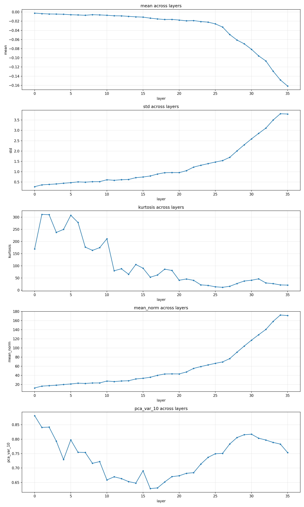
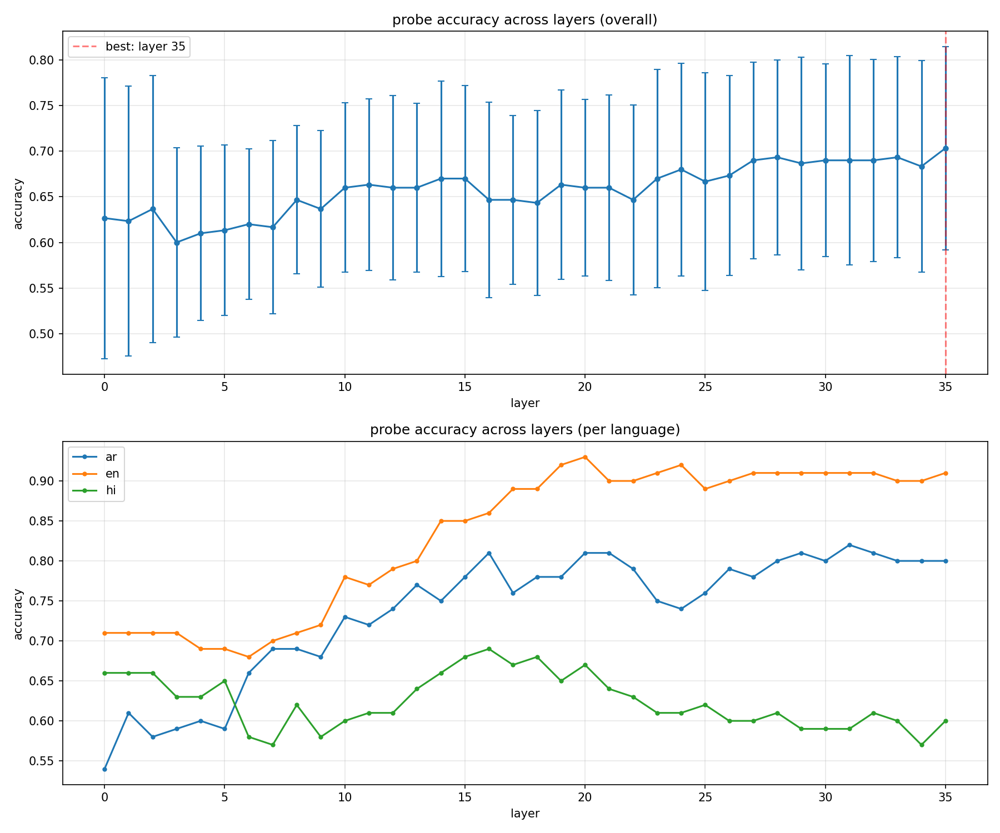

# Baseline and POC runs

## Experiment 1 - Refusal Rates

**Goal** Confrim a measurable cross-lingual safety gap in model behaviour. 

### Results

| Language | Refusals | Total | Refusal Rate |
|----------|----------|-------|-------------|
| English  | 71       | 100   | **71%**     |
| Arabic   | 50       | 100   | **50%**     |
| Hindi    | 34       | 100   | **34%**     |
| Overall  | 155      | 300   | 51.7%       |

### Takeaways 
- 71 % -> 50 % -> 34 % gap is real and large
- Demonstrates the gap in cross-lingual safety 
- Safety behaviour doesn't translate to other languages.

## Experiment 2 - Layers and Probes Analysis

### Layer analysis 

**Goal** analyse acitvation landscape across all 36 layers to identify candidate for SAE hook points.

#### Takeaways
- std and mean norm grow exponentially in final 10 layers, late layer activations dominiated by high magnitue directions, harder for SAE to decompose cleanly.
- kurtosis is very high early but safety computation hasn't happened yet, not useful for SAE.
- PCA var shows a U shape, dips to minimum at layers 14-18, meaning activations are most distributed and high dimensional there, the model is doing a lot of things here.
- Sweet spot for SAE hook - layers 14-20, probe accuracy peaks here, norm's haven't exploded , kurtosis is transitioning.

### Probe analysis 

**Goal** try to pinpoint where the model encodes safety distinction, test if safety direction is shared cross-lingually. 

#### Takeaways

- english has a clean, strong safety distinction by layer 20 ( 90+ %)
- arabic is also very close at 73% 
- no clear distinction as such for hindi
- best hook point decision by looking at english is **layer 20**.