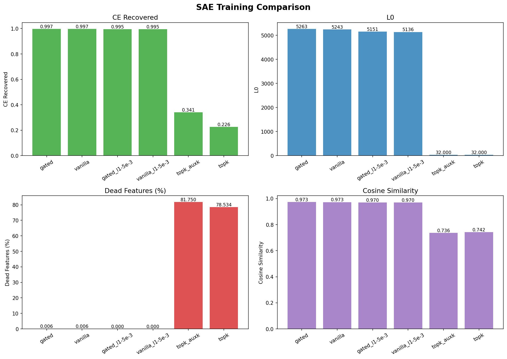

# SAE implementation ablations 

## Architecture Choice 

**Goal** Identify the best SAE architecture to use for cross-lingual safety feature analysis, comparing Vanilla (ReLU + L1), Gated, and TopK across reconstruction quality, sparsity, and feature health.

### Architectures

- **Vanilla (ReLU + L1)** — simplest SAE. Encodes with ReLU activation, sparsity via L1 penalty on feature activations. More L1 = fewer active features.
- **Gated** — separates the "which features to use" decision (gate) from "how much" (magnitude). Learns cleaner sparse representations because the gate can shut features off without shrinking their values.
- **TopK** — forces exactly k features to be active per input, no penalty needed. Sparsity is hard-coded, but features that never get selected become "dead" permanently.

### Metrics

- **L0** — average number of active features per input. Lower = sparser = more interpretable.
- **Dead%** — fraction of features that never activate. Dead features are wasted capacity.
- **CE Recovered** — how much of the original model's behavior the SAE preserves (1.0 = perfect). Measures if the SAE reconstruction still produces the same next-token predictions.
- **Cosine Similarity** — how close the SAE's reconstruction is to the original activation vector (1.0 = identical direction).

### Results

| Run | L0 | Dead% | CE Recovered | Cosine |
|---|---|---|---|---|
| gated (buggy) | 5,263 | 0.006% | 0.9972 | 0.9728 |
| vanilla (buggy) | 5,243 | 0.006% | 0.9970 | 0.9725 |
| gated_fixed | 2,508 | 0.000% | 0.9954 | 0.9418 |
| gated_l1-5e-3 | 5,151 | 0.000% | 0.9953 | 0.9700 |
| vanilla_l1-5e-3 | 5,136 | 0.000% | 0.9950 | 0.9700 |
| vanilla_fixed | 2,000 | 0.000% | 0.9612 | 0.9096 |
| topk_k64_auxk | 64 | 55.96% | 0.5677 | 0.7868 |
| topk_auxk | 32 | 81.75% | 0.3412 | 0.7362 |
| topk | 32 | 78.53% | 0.2260 | 0.7416 |

**Setup:**
- **Model**: CohereLabs/tiny-aya-global (36 layers, d_model=2048)
- **Dataset**: CohereLabs/aya_collection_language_split (english, standard_arabic, hindi)
- **Training**: 5M tokens, layer 20, expansion factor 8x (d_sae=16384), batch size 4096, seed 42
- **Hardware**: NVIDIA H100 GPU
- **Avg time per run**: ~21 min

### Decision

Going ahead with **gated**. at matched L0 after the bug fix, gated outperforms vanilla on CE recovered and cosine similarity with zero dead features. the gate mechanism, separating the sparsity decision from the magnitude decision, demonstrates that it helps reconstruction quality at real sparsity levels.
Excluding TopK at the moment from the candidates, i did two runs with k = 32, 64 both showed > 55% dead features with no covergence directions and finding the optimal k would require independent hyperparametere ablations so skipping this for now.

### Takeaways 
- l1 bug masked sparsity, after the fix, L0 dropped from 5k to 2.5k at the same l1=56-4
- gated beats vanilla at matched sparsity on all reconstruction metrics
